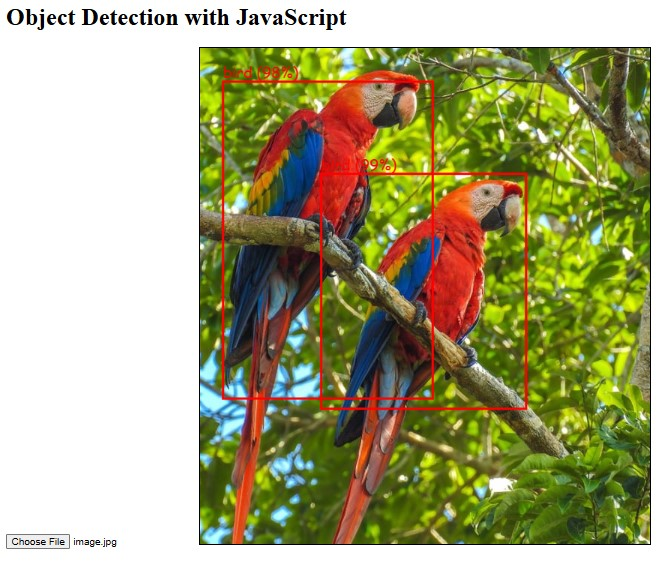
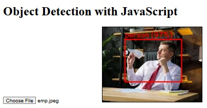
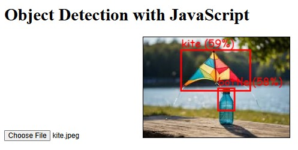

# Object_Detection
This project implements object detection using TensorFlow.js and the COCO-SSD model. Users can upload images, and the application identifies and labels objects with bounding boxes. It showcases real-time detection capabilities in a web browser, leveraging modern JavaScript technologies for an interactive user experience.

Git Clone the Project into your system and run the Index.html File and try with your own images.
 
It Uses API So you need to be connected to internet to get it working 
 
The Output Is As Follows

 

 

 
